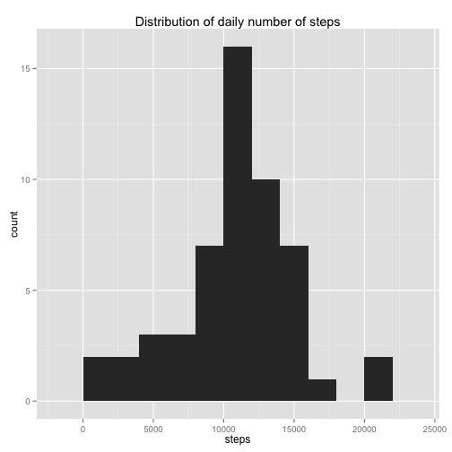
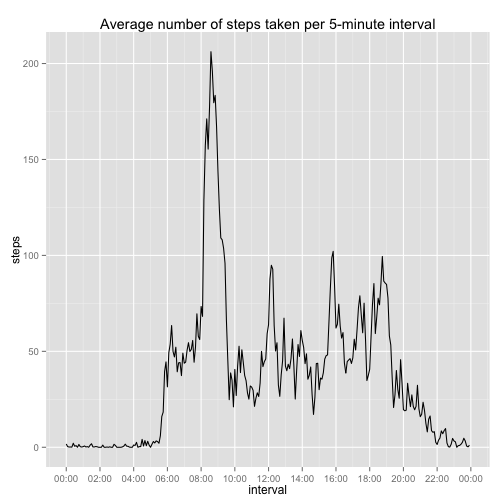
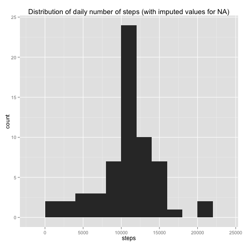
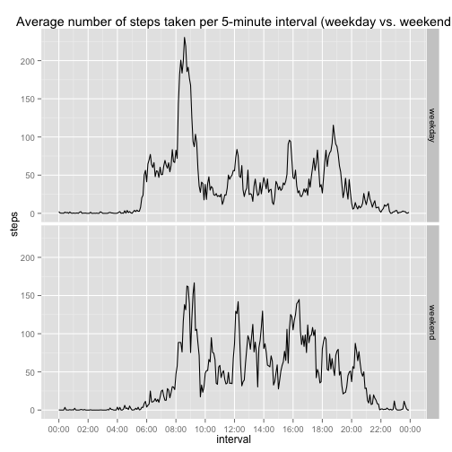

## Loading and preprocessing the data

First we will unzip the file and load the data into the object `data`:


```r
unzip("activity.zip")
data <- read.csv("activity.csv")
```

We tidy up the data by:

* converting date strings into `Date` objects
* converting intervals into `POSIXct` objects


```r
data$date <- as.Date(data$date)

library(lubridate)
data$interval <- fast_strptime(paste("20150614",
                                     sprintf("%04d", data$interval))
                               , "%Y%m%d %H%M")
```

## What is mean total number of steps taken per day?

Aggregate the data by day and draw histogram of daily data:


```r
totalByDay <- aggregate(steps ~ date, data, sum)

library(ggplot2)
qplot(steps, data = totalByDay, geom = "histogram", binwidth = 2000) +
  ggtitle("Distribution of daily number of steps")
```

 

The **mean** daily number of steps is calculated:


```r
mean(totalByDay$steps)
```

```
## [1] 10766.19
```

The **median** daily number of steps is calculated:


```r
median(totalByDay$steps)
```

```
## [1] 10765
```


## What is the average daily activity pattern?

Average each interval across all days and plot time series plot:


```r
avgByInterval <- aggregate(steps ~ interval, data, mean)

library(scales)

qplot(interval, steps, data = avgByInterval, geom = "line") +
  ggtitle("Average number of steps taken per 5-minute interval") +
  scale_x_datetime(breaks = date_breaks("2 hour"),
                   labels = date_format(format = "%H:%M"))
```

 

Compute 5-minute interval with maximum number of steps:


```r
# compute
max <- avgByInterval$interval[avgByInterval$steps == max(avgByInterval$steps)]

# convert back to original format
format(max, format = "%H%M")
```

```
## [1] "0835"
```


## Imputing missing values

Compute the total number of missing values:


```r
sum(is.na(data$steps))
```

```
## [1] 2304
```

To compensate for the missing values, we will use the mean for that specific 5-minute interval.


```r
# copy data
dataImputed <- data

# loop through all rows where steps is NA
for (i in which(is.na(dataImputed$steps))) {
  
  # set value of steps equal to average for corresponding interval
  dataImputed$steps[i] = 
    avgByInterval$steps[avgByInterval$interval == dataImputed$interval[i]]
}
```

Aggregate the imputed data by day and draw histogram of daily data:


```r
totalImputedByDay <- aggregate(steps ~ date, dataImputed, sum)

qplot(steps, data = totalImputedByDay, geom = "histogram", binwidth = 2000) +
  ggtitle("Distribution of daily number of steps (with imputed values for NA)")
```

 

The **mean** daily number of steps is calculated:


```r
mean(totalImputedByDay$steps)
```

```
## [1] 10766.19
```

The **median** daily number of steps is calculated:


```r
median(totalImputedByDay$steps)
```

```
## [1] 10766.19
```

Since there are 8 full days of data missing, by imputing their values to be the averages of the days for which we do have data, the new total average thus remains unchanged from the original dataset.

However, since we have introduced 8 additional data points that are the same as the original average, the median moves closer to the average than in the original dataset (and in fact are now equal).

## Are there differences in activity patterns between weekdays and weekends?

Indicate whether each date in observation is weekday or weekend:


```r
# loop through each row and calculate whether weekday or weekend
for (i in 1:nrow(dataImputed)) {
  if (weekdays(dataImputed$date[i]) %in% 
        c("Monday", "Tuesday", "Wednesday", "Thursday", "Friday")) {
    dataImputed$weekday[i] = "weekday"
  } else {
    dataImputed$weekday[i] = "weekend"
  }
}

# convert variable to factor
dataImputed$weekday <- as.factor(dataImputed$weekday)
```

Average each interval across all days and weekend and plot time series plot:


```r
avgByIntervalImputed <- aggregate(steps ~ interval + weekday, dataImputed, mean)

qplot(interval, steps, data = avgByIntervalImputed, geom = "line", facets = weekday ~ .) +
  ggtitle("Average number of steps taken per 5-minute interval (weekday vs. weekend") +
  scale_x_datetime(breaks = date_breaks("2 hour"),
                   labels = date_format(format = "%H:%M"))
```

 

From this plot, it appears that on weekdays, most activity is concnetrated in the morning between 8 AM and 9 AM, whereas on the weekend, activity is spread out more evenly throughout the day.
