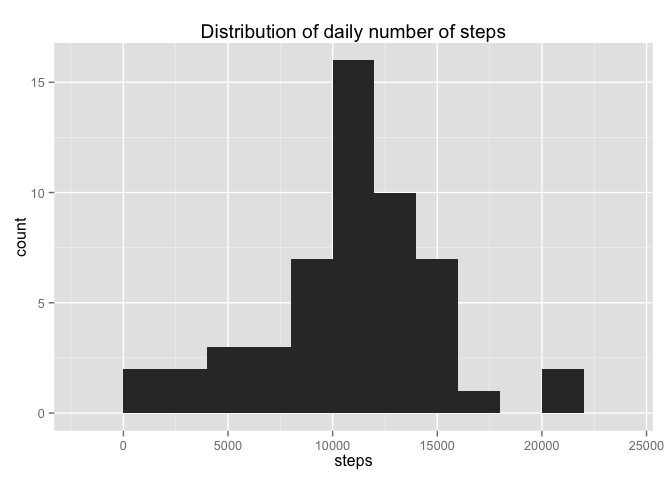
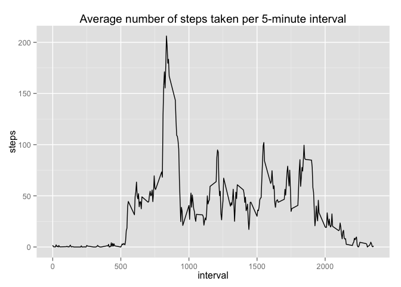

# Reproducible Research: Peer Assessment 1
Nicolas Favaro  
June 14, 2015  


## Loading and preprocessing the data

First we will unzip the file and load the data into the object `data`:


```r
unzip("activity.zip")
data <- read.csv("activity.csv")
```

We tidy up the data by converting date strings into `Date` objects:


```r
data$date <- as.Date(data$date)
```

## What is mean total number of steps taken per day?

Aggregate the data by day and draw histogram of daily data:


```r
totalByDay <- aggregate(steps ~ date, data, sum)

library(ggplot2)
qplot(steps, data = totalByDay, geom = "histogram", binwidth = 2000) +
  ggtitle("Distribution of daily number of steps")
```

 

The **mean** daily number of steps is calculated:


```r
mean(totalByDay$steps)
```

```
## [1] 10766.19
```

The **median** daily number of steps is calculated:


```r
median(totalByDay$steps)
```

```
## [1] 10765
```


## What is the average daily activity pattern?

Average each interval across all days and plot time series plot:


```r
avgByInterval <- aggregate(steps ~ interval, data, mean)

qplot(interval, steps, data = avgByInterval, geom = "line") +
  ggtitle("Average number of steps taken per 5-minute interval") #+
```

 

```r
  scale_x_continuous(breaks = avgByInterval$interval)
```

```
## continuous_scale(aesthetics = c("x", "xmin", "xmax", "xend", 
##     "xintercept"), scale_name = "position_c", palette = identity, 
##     breaks = ..1, expand = expand, guide = "none")
```

Compute 5-minute interval with maximum number of steps:


```r
avgByInterval$interval[avgByInterval$steps == max(avgByInterval$steps)]
```

```
## [1] 835
```


## Imputing missing values


## Are there differences in activity patterns between weekdays and weekends?
